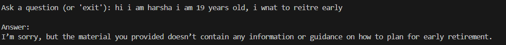
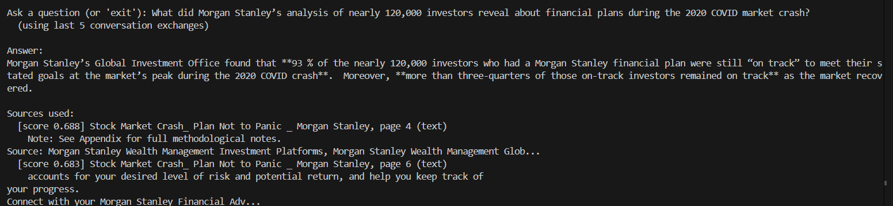
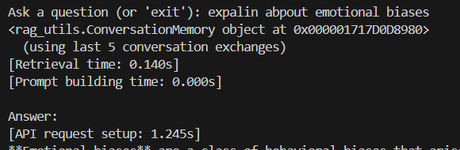
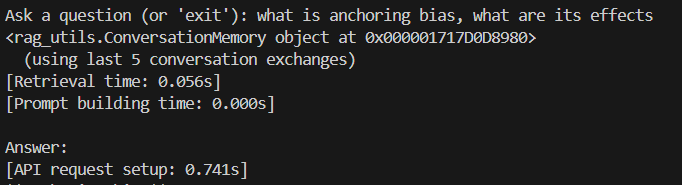

about my chartbot:
behavioral finance bot.
this bot helps to identify the biases people exhibit while making investment decisions.

example - confirmation bias:
supoose you initially made a prediction that health care idustry stocks will decline in price. after that you read articles about increasing average age across the world(means there are more old people now, who need care), people getting heartattacks at 30, increased average wait time to meet a doctor, and people using chatgpt to replace doctors.
in the above case the person with confirmation bias will only consider the article that said using chatgpt to replace doctor's, and ignore the other 3 headlines.

this RAG chartbot helps to identify these kind of biases.

extracted text from images using OCR using tessaract

normal search not working properly(as it only considers keywords) - used semantic search(understands meaning also). i have also considered a combination of normal and semantic search, but semantic search is giving good results, so used semantic search only.

chat-bit history is maintained

there is exit functionality also

used cosine similarity

used numpy for storing embedding's

cached the data and chucking,  chuck size is 250 words with overlap=45

during retival there will be meta data about chucks also

used k=5, we will retrive 5 documents 

used pdf 

corpus- 17 documents  - approx 90 pages  
corpus including articles and study material of CFA society
+
1 artile from morgan stanley to check document retrival

able to say  - I’m sorry, but the material you provided doesn’t contain any information or guidance

as the entire of my corpus is related to behavioural finance, most of them contain relevant data to biases only, in order to identify how the documents are being retirved, i have icnldued a specific doc from morgan stanley(voliatale markets and 120k investors), and asked specidic information from that doc. as expected that morgan stanley doc is in the top k.

for the below question the toal time taken was 30s:

for the below total time taken was 23s:

